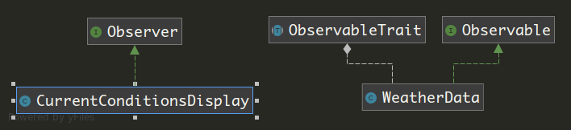

# observer-pattern-exercise

Simple exercises to learn design patterns with php

I will try to explain why this is the best approach (that i know)

The main components of this pattern are:
* The **Subject** or **Observable**: This component has the responsibility of notify his observers on changes.
* The **Observer**: This component is going to be notified by the observable and execute some action.

In this exercise, the Observable is the WeatherData class that has the responsibility of communicate 
any change in the measurements of the Weather conditions. 

The major improvement in this architecture is the possibility of add and remove the observers independently at run-time.

This makes subject and observers lose coupling.
In the moment that a new display is needed, implementing the Observer interface and adding it to the WeatherData on run-time is all is needed.

_No more need to modify the observable._
